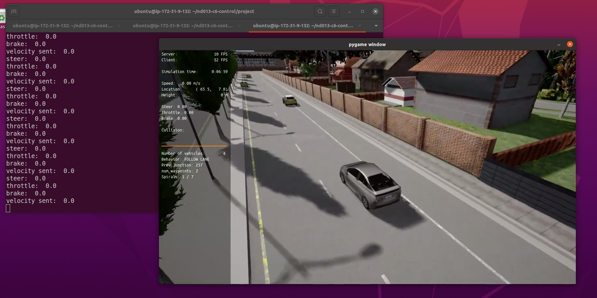
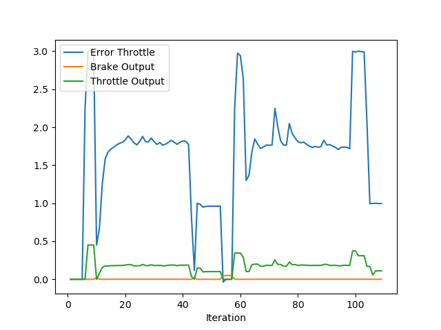
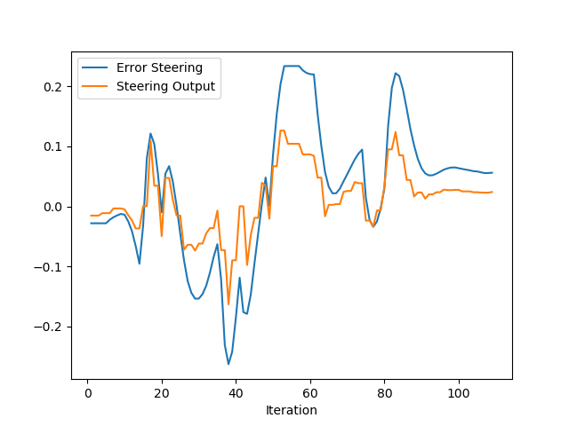

### Stopped Image

### PID Plots
#### Throttle

#### Steering

### Questions

#### 1. Add the plots to your report and explain them (describe what you see)
As we can see in the plots, the shame of the control output generally follows the shape of the error. This is to be expected, as the Proportional term of the PID controller has the largest affect, due to the constants chosen in my implementation. However, we can see that there is very little overshoot.

#### 2. What is the effect of the PID according to the plots, how each part of the PID affects the control command?
One major consideration for my implementation is that the Carla server was running at a very low and inconsistent frame rate. This causes a varying delta-time which dominates the response of the controller.

As $K_P$ causes a fairly significant impact on rise time (or immediate response), I kept it relatively small so that the system had time to respond fluctuations in delta-time. 

$K_I$ is a summation of previous errors, and generally this parameter is very small in PID controllers. However, judging based on the fact that there is almost no overshoot in the Throttle graph, this value could probably have been increased.

$K_D$ can be viewed as "predictive control", and it's effect can most clearly be seen in situations where the control output starts decreasing before the error decreases significantly.

#### 3. How would you design a way to automatically tune the PID parameters?
There are many ways of tuning a PID controller. Generally one can start with some assumed values if a mathematical description of the system is available. There is a lot of research on finding the best starting point. One tuning method is the Ziegler-Nichols method. A good summary of available tuning methods can be found at this link: https://www.incatools.com/pid-tuning/pid-tuning-methods/

However, an approach I would take (with enough compute and simulation time available) is to use a Genetic Algorithm to tune a PID controller. This would effectively be batch gradient descent, just trying out as many values as possible and finding the best one.

#### 4. PID controller is a model free controller, i.e. it does not use a model of the car. Could you explain the pros and cons of this type of controller?
The PID-controller implemented in this project is model-free; however, in a different application a PID-controller could be model-centric. An advantage of a model-free controller is that you don't need a very accuracte mathematical description of the system available and thus it is more experimental.

The disadvantage of this approach however, is that it is quite hard to optimise, especially if testing and simulation takes a significant amount of time. Furthermore, a "optimal" set of parameters aren't really achieveable and it is possible to fall into a local minima quite easy when searching for parameters.

However, with a simple mathematical description of the system, it could be possible to have good starting point when searching for parameters, significantly speeding things up.

#### 5. (Optional) What would you do to improve the PID controller?
As can bee seen in the Throttle plot, the error is significantly larger than the maximum available control output. This problem can be improved by either normalizing the error to a more reasonable value or by giving the velocity planner more "insight" on what the maximum available control output is. Furthermore, it would be interesting to see how the system behaves when the simulation runs at a higher and more consistent framerate.
